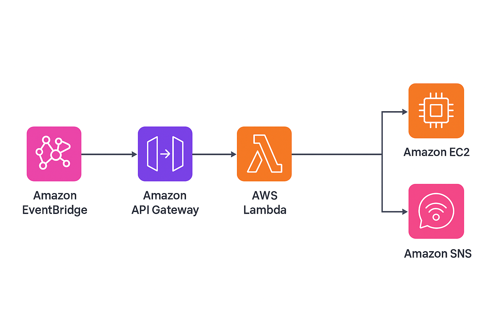

# 🚀 Automated EC2 Start/Stop with API Gateway, EventBridge & SNS

## 📌 Project Overview
1. This project automates the start and stop of an EC2 instance using **AWS Lambda and EventBridge**.
2. **API Gateway** provides two endpoints (/StartEC2, /StopEC2) for manual control.
3. **EventBridge** triggers these endpoints at scheduled times.
4. **SNS** sends email notifications on every action.

## 🏗️ Architecture Diagram

## ⚙️ Step-by-Step Implementation
1. Create IAM role and policies
2. Create SNS topic + subscription
3. Write Lambda function
4. Create API Gateway endpoints
5. Test via Postman / API Gateway
6. Create EventBridge rules for scheduling

## 🧹 Clean-Up Steps
1. Delete EventBridge rules.
2. Delete API Gateway endpoints.
3. Delete Lambda function.
4. Unsubscribe and delete SNS topic.
5. Terminate EC2 instance if not needed.
6. Remove IAM roles/policies.

## ✏️Author
Project contribution by Akanksha under ***aws projects*** repository.
