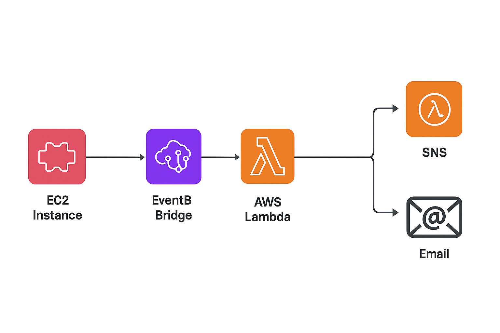

# EC2 State Change Notifications with SNS & EventBridge

### 📌 Project Overview

This project sets up **automatic email notifications** whenever an EC2 instance changes state (e.g., **running**, **stopped**, or **terminated**). Using **Amazon EventBridge** to detect state-change events and **Amazon SNS** for email delivery, this solution ensures you’re always informed about critical changes — whether they were triggered manually, by automation, or due to unexpected issues.

---

### 🏗️ Architecture Diagram

---

### ⚙️ Step-by-Step Implementation

1. **SNS Setup**

   * Create an SNS topic 
   * Add an **Email subscription** to the topic and confirm via email.

2. **EventBridge Rule**

   * Go to EventBridge → **Rules → Create Rule**.
   * Rule type: **Event pattern**.
   * Service: **EC2**.
   * Event type: **EC2 Instance State-change Notification**.
   * Instance: select your specific EC2 instance.
   * States: choose **running** and **stopped**.
   * Target: **SNS topic** created earlier.

3. **Save & Test**

   * Start or stop your EC2 instance manually.
   * You should immediately receive an email notification from SNS.

---

### 🧹 **Clean-Up Steps**

* Delete the EventBridge rule.
* Unsubscribe and delete the SNS topic.
* (Optional) Terminate EC2 instance if no longer needed.

---

### 🔑 **Key Learnings**

* **EventBridge** captures lifecycle events (like EC2 state changes).
* **SNS** provides a quick way to send alerts via email.
* Unlike **CloudWatch Alarms**, which monitor metrics (CPU, memory, etc.), EventBridge notifies on **state changes**.
* Together, they provide visibility into infrastructure changes in real time.

---

### ✏️ **Author**
Project contribution by Akanksha under ***aws projects*** repository.
