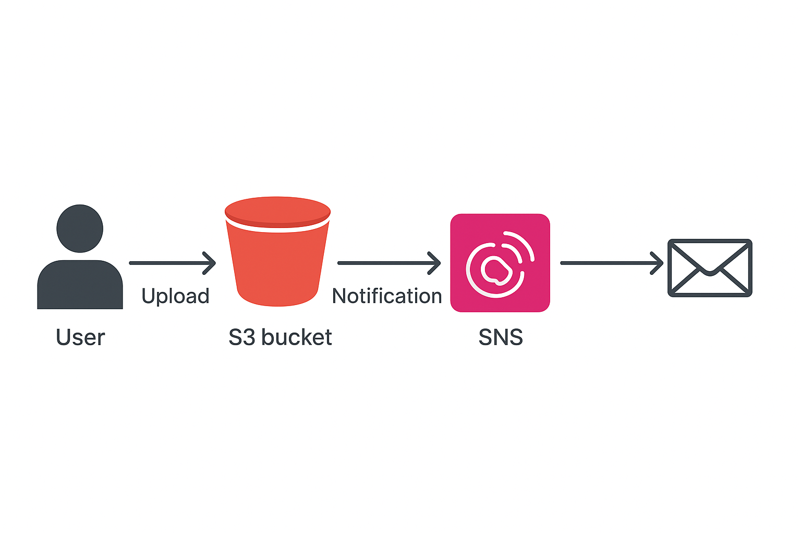

# S3 Presigned URL Upload with SNS Notifications
## 📌 Project Overview

This project demonstrates a secure way to upload files to an Amazon S3 bucket using time-limited presigned URLs.
Each file upload automatically triggers an SNS notification (e.g., email alert) — allowing real-time monitoring of uploads.

---

### 🏗️ Architecture Diagram

---

## ⚙️ Step-by-Step Implementation

1. Create an S3 Bucket
* Open AWS Console → S3 → Create bucket.
* Use a unique name (e.g., mys3bkt-09-25) and region (ap-south-1).
* Keep Block public access ON.

2. Create an SNS Topic

* Go to Amazon SNS → Topics → Create topic.
* Choose Standard type and name it S3Uploads.
* Add a subscription (email).
* Confirm the email link received from AWS.

3. Configure S3 Event Notifications

* Go to your S3 bucket → Properties → Event notifications → Create event notification.
* Name it UploadEvents.
* Event type: All object create events.
* Destination: SNS topic (S3Uploads).
* Save.

4. Upload

* Go to S3 bucket → Upload → Choose a file.
* Once uploaded, SNS will send a notification email.

5. Manual Presigned URL

* Go to S3 → your bucket → Objects.
* Select the file you want to share.
* Click Actions → Share with a presigned URL.
* Choose the expiry time (e.g., 1 hour) and copy the generated link.
* Use this link to download or share the file securely.

---

🧹 Clean-Up Steps

* Delete uploaded objects – Go to your S3 bucket → Objects → select all → Delete.
* Delete the bucket – Once empty, choose the bucket → Delete bucket.
* Delete SNS topic – Open Amazon SNS → Topics → select your topic → Delete.
* Remove email subscriptions – In SNS, delete any active email subscriptions.

